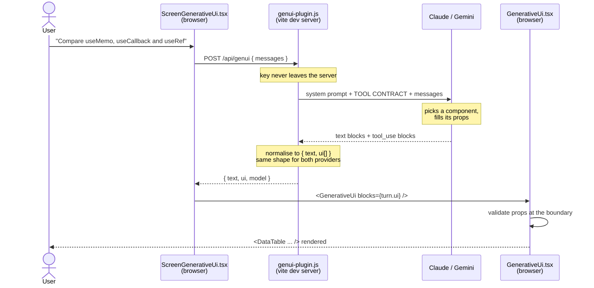
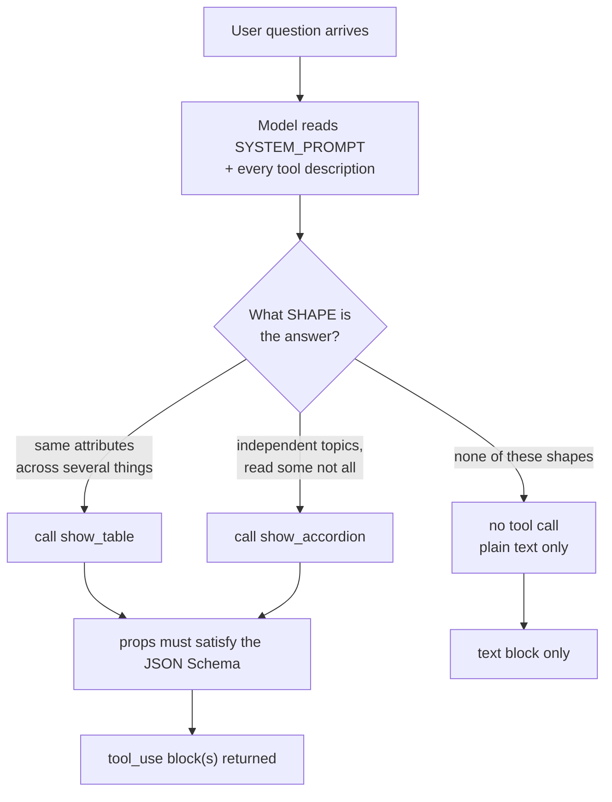

# 02 — How the whole thing works

Four views of the same system, zooming in each time.

## View 1: The round trip



The thing to notice: **the browser never talks to the model, and the model never
sees React.** The API route is a translation layer in both directions.

## View 2: The layers (where each file sits)

```
┌─────────────────────────────────────────────────────────────────┐
│  CONTRACT          src/genui/tools.js                           │
│                                                                 │
│  UI_COMPONENTS = [ { name, description, schema }, ... ]         │
│  SYSTEM_PROMPT                                                  │
│                                                                 │
│         ┌──────────────────┴──────────────────┐                 │
│         ▼                                     ▼                 │
│  toAnthropicTools()                    toGeminiTools()          │
│  input_schema + strict:true            parameters, no           │
│                                        additionalProperties     │
└─────────────────────────────────────────────────────────────────┘
                              │
                              │  one source of truth, two dialects
                              ▼
┌─────────────────────────────────────────────────────────────────┐
│  SELECTION         server/genui-plugin.js                       │
│                                                                 │
│  askAnthropic()  ─┐                                             │
│                   ├─►  { text, ui: [{ id, name, props }] }      │
│  askGemini()     ─┘                                             │
│                                                                 │
│  provider chosen by which API key exists                        │
└─────────────────────────────────────────────────────────────────┘
                              │
                              │  HTTP, plain JSON
                              ▼
┌─────────────────────────────────────────────────────────────────┐
│  RENDERING         src/genui/GenerativeUi.tsx                   │
│                                                                 │
│  renderBlock({ name, props })                                   │
│    name === SHOW_TABLE      ─► validate ─► <DataTable />        │
│    name === SHOW_ACCORDION  ─► validate ─► <AccordianV3 />      │
│    unknown                  ─► null (skip, don't crash)         │
└─────────────────────────────────────────────────────────────────┘
```

The contract file is deliberately **provider-neutral**. `UI_COMPONENTS` is
written once; `toAnthropicTools()` and `toGeminiTools()` reshape it. When you add
a component you touch the neutral list only — both providers get it for free.

## View 3: The model's decision

What actually happens inside the "picks a component" step:



The branch labels are *literally the words in your `description` fields*. That's
the lever you control. If the model picks wrong, you rewrite a branch label —
you don't write code.

## View 4: Anatomy of one contract entry

How a single component definition flows all the way to the screen:

```
   WHAT YOU WRITE (tools.js)              WHAT THE MODEL EMITS
   ─────────────────────────              ────────────────────
   name: "show_table"           ──────►   "name": "show_table"
         │                                        │
         │ identity: the key the                  │ renderBlock() switches
         │ renderer switches on                   │ on this
         ▼                                        ▼
   description: "Use when the     ──┐      ┌─ picks THIS tool over
   answer compares things..."       │      │  the others
         │                          └─────►│
         │ THE PROMPT. decides             └─ (never appears in output)
         │ whether it's chosen
         ▼
   schema: {                      ──────►   "input": {
     columns: string[]                        "caption": "Hook comparison",
     rows:    string[][]                      "columns": ["Hook","Returns"],
     required: [...]                          "rows": [["useMemo","value"]]
     additionalProperties: false            }
   }                                              │
         │                                        │
         │ the shape; strict:true                 ▼
         │ makes it guaranteed              props passed to <DataTable />
         ▼                                  AFTER runtime validation
   must match DataTableProps
```

Three fields, three different jobs:
- `name` → **identity** (renderer dispatch)
- `description` → **selection** (the actual prompt)
- `schema` → **shape** (what props arrive)

Getting `description` wrong means the component never gets used, or gets used for
the wrong questions. Getting `schema` wrong means it's chosen and then fails to
render. These are different bugs with different fixes.

## Where the two providers differ

Same contract, two dialects — handled in `tools.js`:

| | Anthropic | Gemini |
|---|---|---|
| Schema field | `input_schema` | `parameters` |
| Wrapping | flat array of tools | one `functionDeclarations` block |
| `additionalProperties` | supported, used with `strict: true` | **rejected** — stripped by `stripUnsupported()` |
| Where calls appear | `content[]` blocks of `type: "tool_use"` | `response.functionCalls` |
| Text when tool-only | normal text blocks | `.text` may throw — hence the `try/catch` |

`strict: true` on the Anthropic side is worth knowing about: it makes the API
*guarantee* the arguments validate against your schema. Gemini has no equivalent
here, which is exactly why `GenerativeUi.tsx` validates anyway. **Validate at the
boundary regardless of provider** — it costs ten lines and turns a white screen
into a skipped block.

---

Next: [03 — adding tabs, step by step](03-tabs-step-by-step.md)
